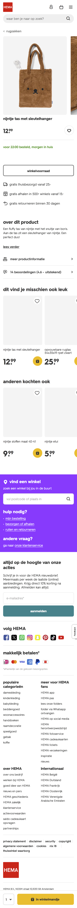
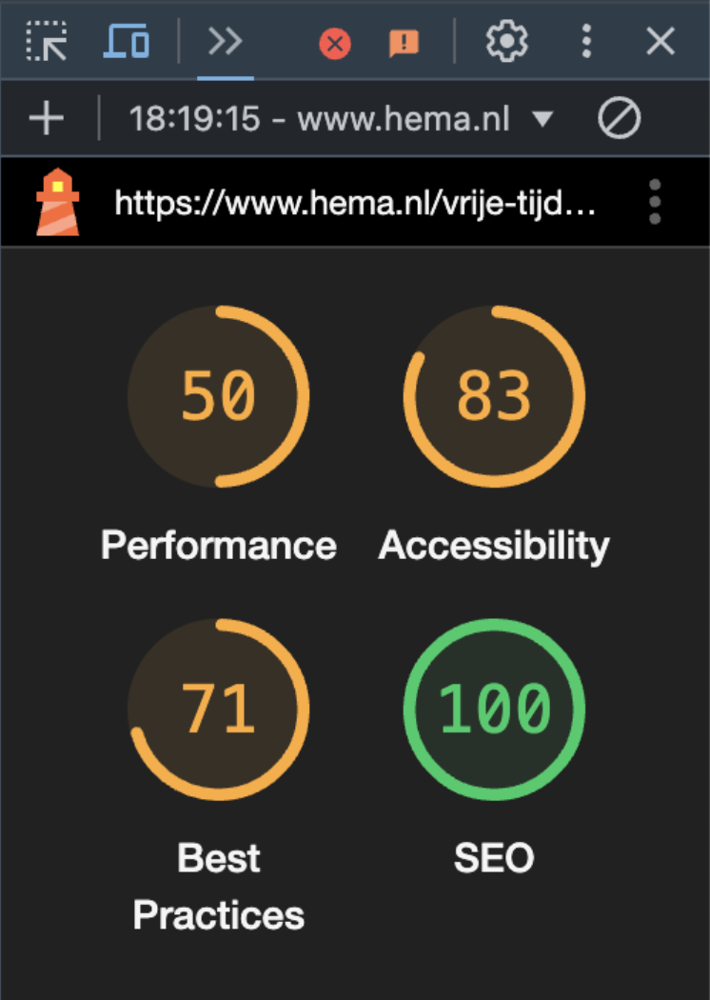
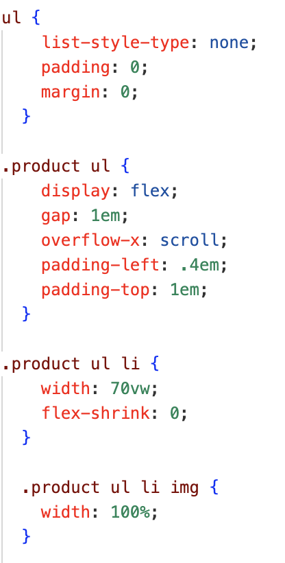
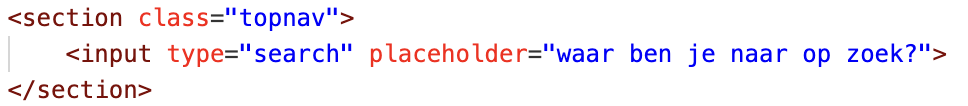
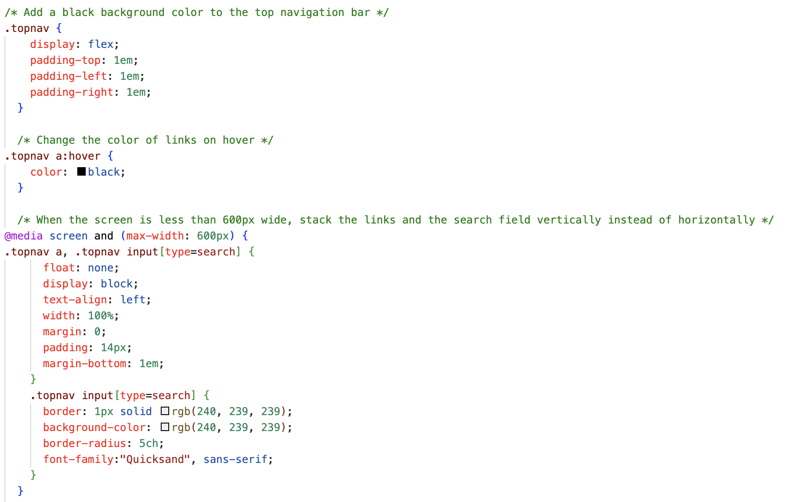
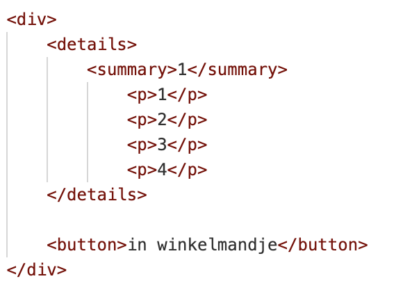
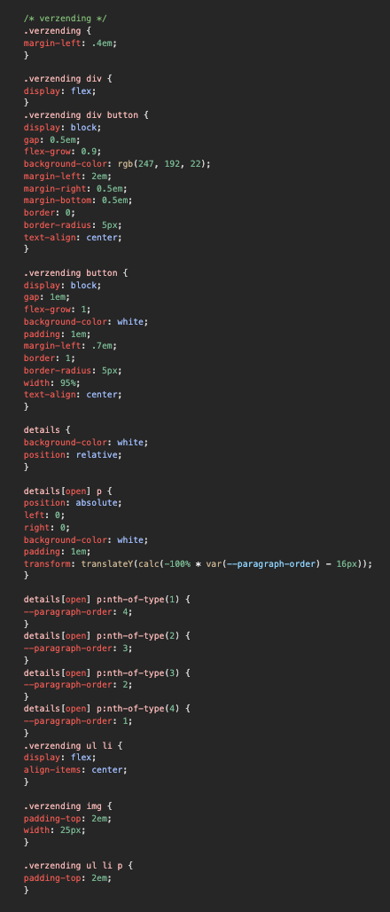
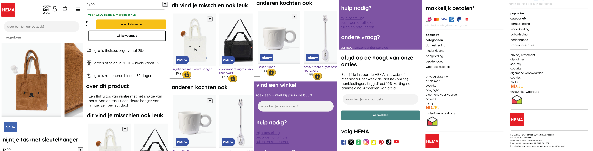
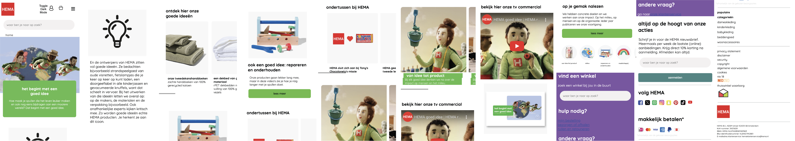

# Procesverslag
Markdown is een simpele manier om HTML te schrijven.  
Markdown cheat cheet: [Hulp bij het schrijven van Markdown](https://github.com/adam-p/markdown-here/wiki/Markdown-Cheatsheet).

Nb. De standaardstructuur en de spartaanse opmaak van de README.md zijn helemaal prima. Het gaat om de inhoud van je procesverslag. Besteedt de tijd voor pracht en praal aan je website.

Nb. Door *open* toe te voegen aan een *details* element kun je deze standaard open zetten. Fijn om dat steeds voor de relevante stuk(ken) te doen.

## Jij

  
uitwerken voor kick-off werkgroep

  ### Auteur:
  Carmen Zoutendijk

  #### Je startniveau:
  Blauw (lager als mogelijk)

  #### Je focus:
  Surface plane
 

## Je website

  
uitwerken voor kick-off werkgroep

  ### Je opdracht:
  https://www.hema.nl/?gad_source=1&gclid=CjwKCAjwooq3BhB3EiwAYqYoElspCGjAcw40xIW6Ed2oEGb_II-YrLu2ITNmXw1M1VNWQDbGQAQIgRoCul8QAvD_BwE&gclsrc=aw.ds 

  #### Screenshot(s) van de eerste pagina (small screen): 
  

    
Detail pagina 1 - nijntje tas

    
  

  
  #### Screenshot(s) van de tweede pagina (small screen):
  

    
Detail pagina 2 - goed idee

    
  

 

## Toegankelijkheidstest 1/2 (week 1)

  
uitwerken na test in 2e werkgroep

  ### Bevindingen
  Lijst met je bevindingen die in de test naar voren kwamen:
  - screen reader is (voor mij) heel warrig. Hij leest dingen voor waar ik nog helemaal niet om "vroeg".
    Ook gaat het heel snel waardoor ik het niet bij kan houden, maar mensen die hier aan gewend zijn zouden dit misschien wel bij kunnen houden.
    
  - ik heb de website nagekeken met "lighthouse" die aangeeft dat de hema website een 83/100 scoort op toegankelijkheid.
    Dit is geen geweldige score, maar het kan natuurlijk wel erger, dus is de Hema denk ik vrij goed op weg. 
    

  - Ik zie geen optie voor een dark/light-mode, maar dat was wel handig geweest voor mensen die bijvoorbeeld niet tegen zo'n vel witte achtergrond kunnen.

## Breakdownschets (week 1)

  
uitwerken na afloop 3e werkgroep

  ### de hele pagina: 
  

    
Pagina 1 nijntje tas

    
  

   

    
Schetsen

    
  

  ### dynamisch deel (bijv menu): 
  

    
Hamburgermenu

    
  

  

## Voortgang 1 (week 2)

  
uitwerken voor 1e voortgang

  ### Stand van zaken
  Wat ging er goed:
  - het maken van de scroll container ging goed! Ik had dit nooit eerder gedaan en dacht dat het heel ingewikkeld zou zijn, maar na wat uitleg van het internet en de nodige aanpassingen ging het prima en heb ik de scroll container op meerdere plekken toegepast.
    
  

    
scroll container code

    
  

  
  Wat was lastig:
  - de zoekbalk maken vond ik wel lastig, ik kreeg 'm maar niet zoals op de originele website, maar ik heb er gewoon veel aan zitten priegelen en elke code die ik kon bedenken getest, totdat hij er goed uitzag. 

  

    
zoekbalk code

    
    
  

  ### Agenda voor meeting - NVT
  samen met je groepje opstellen 

  | student 1      | student 2          | student 3    | student 4        |
  | ---            | ---                | ---          | ---              |
  | dit bespreken  | en dit             | en ik dit    | en dan ik dat    |
  | en dat ook nog | dit als er tijd is | nog een punt | dit wil ik zeker |
  | ...            | ...                | ...          | ...              |

  ### Verslag van meeting
  hier na afloop snel de uitkomsten van de meeting vastleggen

  - type="text" veranderen in type="search"
  - een sneller tempo aan gaan houden

## Voortgang 2 (week 3)

  
uitwerken voor 2e voortgang

  ### Stand van zaken
    Wat ging er goed:
  - Ik heb kleine dingen toegevoegd, zoals buttons en meer tekst. Ook heb ik met behulp van één van de studentassistentes een uitklap functie gemaakt om het aantal producten aan te passen.
    
  
  Wat was lastig:
  - Ik vond het lastig om verder te werken, omdat ik niet goed wist hoe ik moest beginnen (codeer blok) 

  ### Agenda voor meeting - NVT
  samen met je groepje opstellen

  | student 1      | student 2          | student 3    | student 4        |
  | ---            | ---                | ---          | ---              |
  | dit bespreken  | en dit             | en ik dit    | en dan ik dat    |
  | en dat ook nog | dit als er tijd is | nog een punt | dit wil ik zeker |
  | ...            | ...                | ...          | ...              |

  ### Verslag van meeting
  hier na afloop snel de uitkomsten van de meeting vastleggen

  - de eerste pagina had eigenlijk al veel verder moeten zijn

## Toegankelijkheidstest 2/2 (week 4)

  
uitwerken na test in 9e werkgroep

  ### Bevindingen
  - ik heb 'alt' tags aan mijn images toegevoegd, zodat de screenreader deze kan lezen
  - wel moet ik nog een dark/lightmode maken

## Voortgang 3 (week 4)

  
uitwerken voor 3e voortgang

  ### Stand van zaken
  Wat ging er goed:
  - Ik ben ver gekomen met mijn eerste pagina en al begonnen aan de tweede. Ik wilde eerst eigenlijk de eerste pagina helemaal af maken, voordat ik zou beginnen aan de tweede pagina, maar omdat ik een beetje vastliep ben ik begonnen met de tweede pagina. 
  
  Wat was lastig:
  - Ik vond het lastig om plaatje precies naast tekst te plaatsen, maar heb ik uiteindelijk hulp bij gekregen van een student assistente!
    

  ### Agenda voor meeting - NVT
  samen met je groepje opstellen

  | student 1      | student 2          | student 3    | student 4        |
  | ---            | ---                | ---          | ---              |
  | dit bespreken  | en dit             | en ik dit    | en dan ik dat    |
  | en dat ook nog | dit als er tijd is | nog een punt | dit wil ik zeker |
  | ...            | ...                | ...          | ...              |

  ### Verslag van meeting
  hier na afloop snel de uitkomsten van de meeting vastleggen

  - de eerste pagina moet af zijn en de tweede pagina had ook verder moeten zijn

## Eindgesprek (week 5)

  
uitwerken voor eindgesprek

  ### Je uitkomst - karakteristiek screenshots:
  
  

  ### Dit ging goed/Heb ik geleerd: 
  - ik heb geleerd een scroll container te maken
  - ik heb geleerd een zoekbalk te maken
  - ik heb geleerd om extreem snel te werken

  ### Dit was lastig/Is niet gelukt:
  - het beginnen was vooral moeilijk, omdat ik niet altijd wist waar en hoe ik moest beginnen
  - twee pagina's in drie weken tijd maken was ook echt heel erg lastig

## Bronnenlijst

  
continu bijhouden terwijl je werkt

  Nb. Wees specifiek ('css-tricks' als bron is bijv. niet specifiek genoeg). 
  Nb. ChatGpT en andere AI horen er ook bij.
  Nb. Vermeld de bronnen ook in je code.

  1. Zoekbalk. Ik heb opgezocht hoe ik een zoekbalk in html css kon maken en heb dat antwoord uiteindelijk hier gevonden: https://www.w3schools.com/howto/howto_css_searchbar.asp
  2. afbeeldingen gebruikt van de HEMA website zelf: logo en profile/basket images.
  3. image scrollbar code (wel zelf hier en daar aangepast om bij mijn website te passen): https://www.w3schools.com/howto/howto_css_image_gallery_scroll.asp
  4. tekstveld laten overlappen met een image: https://www.bannerbear.com/blog/how-to-overlay-text-on-an-image-in-html-and-css/#:~:text=Overlaying%20Text%20on%20an%20Image%20in%20HTML%20and%20CSS,-HTML&text=In%20the%20body%20section%2C%20create,and%20add%20your%20text%20inside.&text=We%20know%20that%20in%20real,to%20contain%20an%20image%20only.
  5. dark/light mode via chatgpt: https://chatgpt.com/c/67292c34-9c38-800b-8baa-e4af9756efc6

